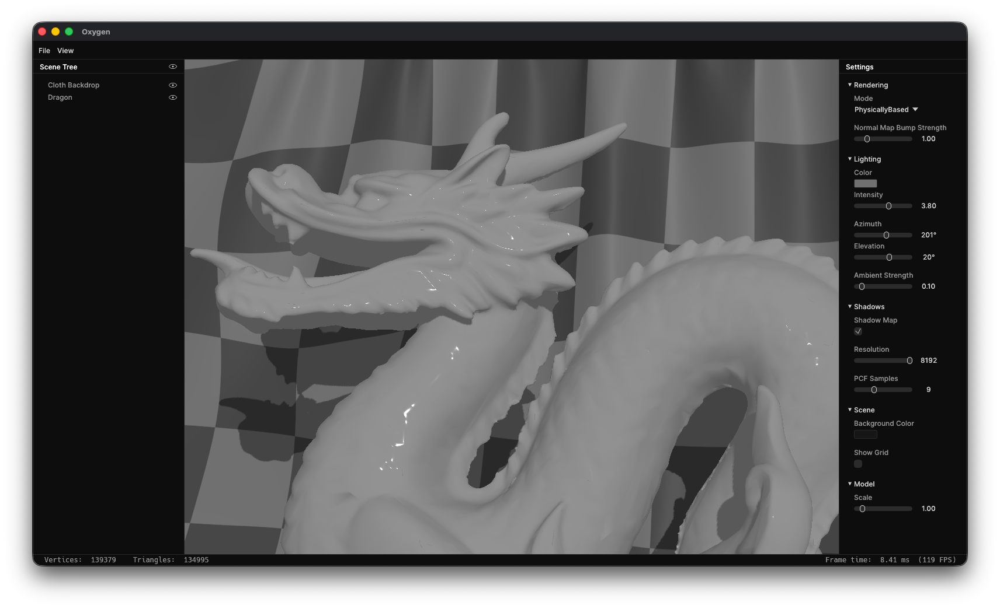

### Hi, there! 👋

I'm Arjun Singh Kalra, a Software Engineer with a background in Mathematics. I focus on real-time graphics and high-performance compute.

### What I've built

**[Oxygen](https://github.com/asinghka/oxygen-renderer)** — a real-time glTF viewer and scene editor built in Rust and wgpu. Cook–Torrance PBR, shadow mapping with PCF, tangent-space normal mapping, and live editing of lighting and material parameters.

  

**[ImageFlow](https://github.com/asinghka/image-flow)** — a node-graph image editor in Rust and wgpu that compiles an operator graph into a chain of WGSL compute passes. Intermediates stay resident on the GPU with no host round-trip.

  

**[Burr Puzzle Wizard](https://github.com/asinghka/burr-puzzle-wizard)** — a C++ solver and OpenGL viewer for burr puzzles. Disassembly is modeled as graph traversal, with voxelized bitset pieces for fast collision checks and best-first search that solves 18-piece puzzles in ~209 ms.

  

